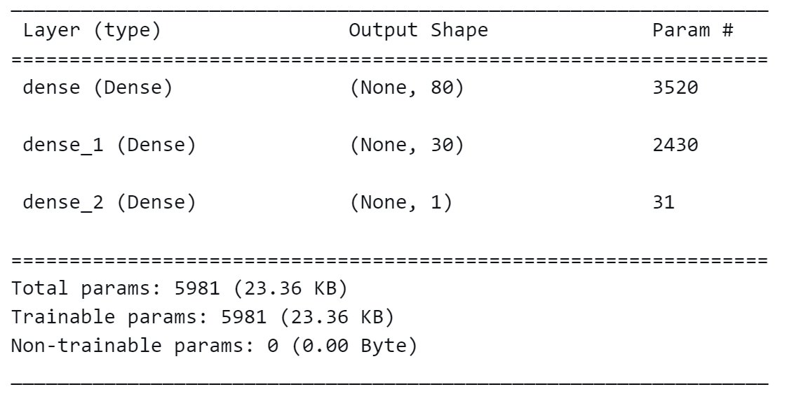
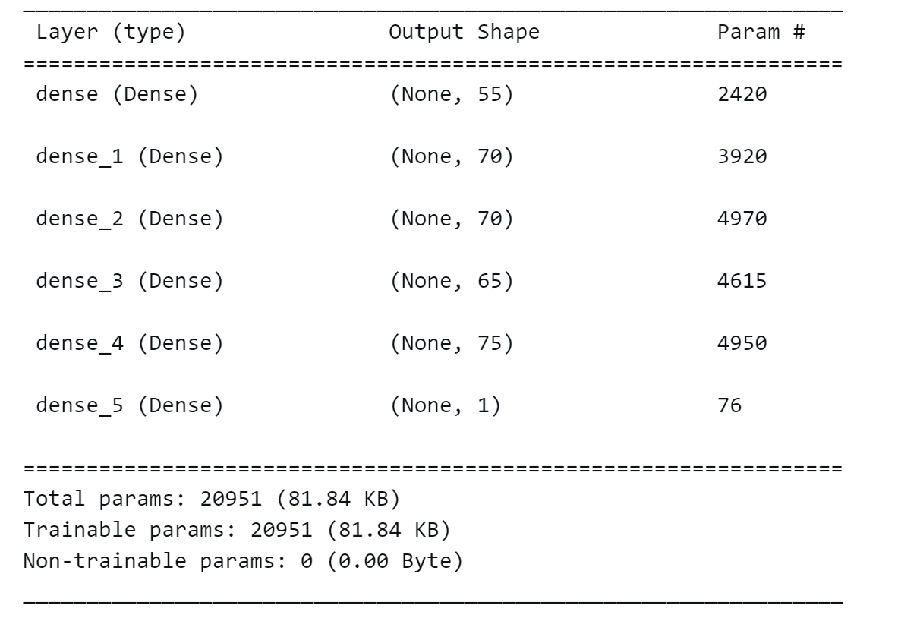

# Deep Learning Model Performance Report for Alphabet Soup

## Overview of the Analysis

The purpose of this analysis is to develop a deep learning model that assists the nonprofit foundation Alphabet Soup in identifying the organizations most likely to succeed if they receive funding. Utilizing a dataset of over 34,000 past funded organizations, the model aims to predict the effectiveness of money use based on various organizational metadata.

## Results

### Data Preprocessing

- **Target Variable(s):**
  - `IS_SUCCESSFUL`: Indicates whether the money given to an organization was used effectively.

- **Feature Variable(s):**
  - `APPLICATION_TYPE`: The type of funding application.
  - `AFFILIATION`: Sector of industry affiliation.
  - `CLASSIFICATION`: Government organization classification.
  - `USE_CASE`: Intended use of the funds.
  - `ORGANIZATION`: Type of organization.
  - `STATUS`: Active status of the organization.
  - `INCOME_AMT`: Income level of the organization.
  - `SPECIAL_CONSIDERATIONS`: Any special considerations for the application.
  - `ASK_AMT`: Amount of funding requested.

- **Variables to Remove:**
  - `EIN` and `NAME`: These are identification columns and do not contribute to the predictive model.

### Compiling, Training, and Evaluating the Model

- **Neurons, Layers, and Activation Functions:**
  - Selected a three-layer neural network with 80 neurons in the first hidden layer, 30 in the second hidden layer, and 1 in the output layer.
  - Used ReLU activation function for hidden layers for non-linear processing and sigmoid for the output layer for binary classification.
  - The choice of neurons and layers was based on the complexity of the dataset and the need for a model capable of capturing non-linear relationships.

- **Achievement of Target Model Performance:**
  - The initial model did not achieve the target performance, prompting further optimization.

- **Steps to Increase Model Performance:**
  - Performed feature engineering to create additional meaningful features.
  - Adjusted the number of neurons and layers.
  - Experimented with different activation functions.
  - Implemented various regularization techniques to reduce overfitting.
  - Utilized different batch sizes and epoch numbers during training.

### Summary of Deep Learning Model Results

The deep learning model developed for Alphabet Soup has been trained and evaluated, yielding an accuracy of approximately 72.87% with the first configuration and 72.62% with the second. The optimized model employed a `tanh` activation function across four hidden layers with the following neurons: 70, 70, 65, and 75 respectively, in addition to the input layer with 55 units. This architecture resulted in a loss of 0.5557. The hyperparameter tuning process involved multiple epochs, with specific settings controlled by the tuner.

The initial model configuration, with a simpler three-layer architecture (80 neurons in the first layer, 30 in the second, and a single output neuron), resulted in a marginally lower loss of 0.5537. The total number of trainable parameters was 5981.

While both models achieved similar accuracies, there's a slight edge in the loss metric for the initial, simpler model. This could indicate a more efficient learning process, possibly due to a better match of model complexity to the underlying data patterns.

### Recommendations for Alternative Models

**Gradient Boosting Machines (GBMs):** 
Given the modest accuracy achieved by the neural networks and the complexity of the dataset, a GBM might improve performance. GBMs are powerful ensemble learning models that build trees in a sequential manner where each tree corrects the errors of the previous ones. They are particularly good for tabular data, often outperforming neural networks unless the dataset is very large.

**Random Forest:**
A Random Forest classifier could be another robust alternative. As an ensemble of decision trees, it is known for its performance with classification tasks. It handles a mix of feature types well and provides importance scores for features, which can be insightful for further data analysis and model refinement.

**Support Vector Machine (SVM):**
An SVM with a non-linear kernel (like RBF) could also be effective, especially if the dataset is not too large. SVMs are effective in high-dimensional spaces and are versatile with various kernel functions to handle non-linear separations.

**Model Stacking:**
Stacking several different models together could also be beneficial. This technique involves training multiple models and using their predictions as input for a final meta-model. The diversity of the base models can lead to better generalization on unseen data.

**Further Steps:**

- **Feature Engineering:** Refine the input features, possibly adding new features or transforming existing ones to better capture the underlying patterns.
- **Hyperparameter Tuning:** Additional tuning of model hyperparameters could yield better results. This includes the architecture of neural networks as well as parameters for models like GBMs or SVMs.
- **Cross-validation:** Implementing k-fold cross-validation would ensure that the model's performance is consistent across different subsets of the data.
- **Data Augmentation:** If the dataset is unbalanced or limited, techniques to augment the data can be beneficial for improving model performance.

---
© 2022 edX Boot Camps LLC. Confidential and Proprietary. All Rights Reserved.